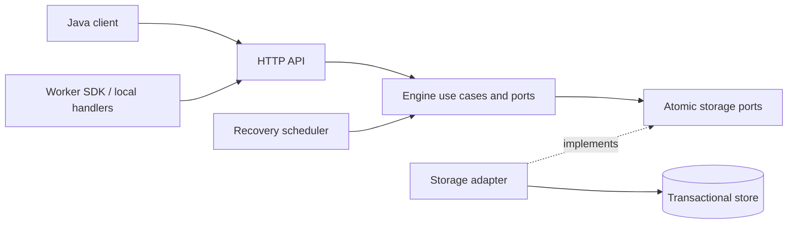

# M1 foundation — proposed architecture

author: architect
task_id: M0-ARCH-001; M1-DESIGN-001
status: DRAFT_FOR_OWNER_DECISION
updated_at: 2026-10-03 20:10 +07:00 (Asia/Saigon)
source_branch: agent/architecture/m1-foundation
references: GOV-001; GOV-002; GOV-003 at efca8bc9c1758848bce9c7721f19adfdca651277; COORD-ROAD-001 at 4a18310a0af1f982ab326b77c496b4721fd8ef18; planning at 2ce8a98f810cd00d268332ad68df45fc8f99a866

Nothing in this document is an accepted architecture, implementation permission or measured guarantee. Baseline 9a45b111847685255cf1006a2b839d31ecdf31a4 contains framework documents only. Decisions are collected in [ARCH-PROP-001](../../.ai/proposals/ARCH-PROP-001-m1-foundation.md); operational state is read from Coordinator's published branch, not this worktree's historical context copies. GOV-003 keeps develop for normal integration and developer for bootstrap; Release activation and actual develop setup remain pending.

## WHY and scope

Make one job traceable from submit to durable outcome, including duplicate requests and process failure, before adding DAG or broker complexity. Recommend one logical server application, independently deployable workers, one transactional store and HTTP JSON as the initial wire contract. Multiple server replicas may compete for work; atomic storage claims decide ownership. This is a modular application, not a proposed microservice per module.

M2 needs a small portion of M3: expiring claims, renewal, bounded recovery and stale-result rejection. Otherwise a worker crash either strands a job indefinitely or demands unsafe manual resubmission. This dependency change is proposed for Owner acceptance and Coordinator scheduling. Business-error retries, timeouts, cancellation, delayed scheduling, DAG, broker/outbox/DLQ and SDK starter convenience remain later work. M2 includes immediate jobs, declared task schemas, submit/query, capacity-bounded pull, execution and outcome.

## WHAT — boundaries and dependency direction

| Component / existing planned path | Responsibility | Permitted dependency direction, proposed |
|---|---|---|
| `chronos-server/chronos-engine/` | Domain vocabulary, invariants, use cases and storage ports | Plain Java; no SDK, Spring, HTTP, SQL or Kafka imports |
| `chronos-server/chronos-scheduler/` | Bounded expired-attempt recovery; later due-time policy | Engine use cases; no worker network dispatch or direct storage internals |
| `chronos-server/chronos-storage/` | Atomic persistence adapters, query plans and migration integration | Implements engine ports; no SDK dependency |
| `chronos-server/chronos-messaging/` | Future transport adapter if accepted | Future engine event contracts; empty/deferred in M2 |
| Proposed `chronos-server/chronos-api/` | HTTP authentication, validation and mapping | Engine + proposed wire contract; no business transitions in controllers |
| Proposed `chronos-server/chronos-app/` | Composition, config and server lifecycle | Wires API, engine, storage, scheduler; module libraries never depend on app |
| Proposed `chronos-contracts/` | Versioned wire specification and compatibility fixtures | No runtime dependency on server or SDK; spec only, no shared Java domain jar |
| `chronos-sdk/chronos-java-sdk/` | Submit/query HTTP client and public errors | Public SDK types/codecs; no server or storage imports |
| `chronos-sdk/chronos-worker-sdk/` | Local handler registry, pull/renew/complete and lifecycle | Client transport reuse within SDK; no server imports |
| `chronos-sdk/chronos-spring-boot-starter/` | Later Spring integration | SDK modules; never server modules |
| `chronos-sdk/chronos-test/` | SDK-facing testing utilities | Public SDK surface; cross-module failure harness stays Reliability-owned |

New paths are proposals, not created code modules or ownership grants. HTTP controllers and composition warrant explicit missing paths because neither fits storage nor the pure engine. Avoid a catch-all shared-code module: wire specifications belong to a reviewed contract; persistence records remain private. SDK/server map wire values into separate internal types, paying some mapping duplication to keep dependency and release boundaries clear.

## FLOW and deployment

Worker pulls only with free execution capacity. Server returns an assignment only after claim commit; handler and external effects run outside database transactions. Completion is a separate authenticated conditional write. Recovery finds expired ownership through the same engine/storage contract. No mandatory message event lies between accepted submit and execution in this proposal; the durable queue itself is the work source. Full behavior: [M1 first job](../design/m1-first-job.md).

## Dependencies/build — recommendation and alternatives

| Choice, still proposed | Recommendation | Alternative / cost |
|---|---|---|
| Java baseline | Java 21 source/API target; test newer JDK separately before claiming compatibility | Java 25 target if Owner favors newer baseline; smaller older-client support surface |
| Build | Maven multi-module with committed wrapper and pinned plugins/dependencies | Gradle if Owner prefers its task model; do not maintain both |
| Server framework | Spring Boot current supported family, choose/pin exact compatible release during M0 | Plain HTTP framework lowers Spring coupling but increases composition work; Boot 3-family client compatibility must be assessed if requested |
| Storage | PostgreSQL, explicit SQL adapter for transaction/claim visibility | Embedded DB useful for limited unit tests, insufficient as substitute for the selected DB concurrency evidence; another DB requires equivalent unique/CAS/clock semantics |
| Delivery | Worker pull over HTTP, store-backed availability | Broker needs durable event intent/publish/ACK/dedup contracts in M2, moving M5 minimum earlier; latency benefit unmeasured |
| Payload | Versioned UTF-8 JSON with explicit task codecs and allowlisted schema validators | Binary formats can improve size/typing but increase first-demo integration burden |
| Tests/schema | Behavior unit tests plus selected real DB integration environment; one migration runner with immutable released migrations | Container-based fixtures if available; dedicated DB otherwise, record cleanup/isolation and environment |

No patch versions, artifacts or executable build commands are invented here. Release must propose exact JDK distribution, Maven/wrapper/plugin, Spring, JDBC/JSON/validation/test/migration versions, validate compatibility/security/support and commit a reproducible manifest before M0 exit. Boot's published system requirements govern its compatible Java/build versions ([official requirements](https://docs.spring.io/spring-boot/system-requirements.html), checked 2026-10-03); this check does not select a release for Chronos. Maven's reactor supports multi-module ordering ([official guide](https://maven.apache.org/guides/mini/guide-multiple-modules.html)); the recommendation is an Architect judgment, not an existing build.

## FAILURE / operational boundary

DB commit is the durability boundary under the configured DB durability/backup assumptions. A lost HTTP response yields an unknown client outcome and a replay with the same key; no SDK guarantee of success until receipt or query. Store outage stops new ownership/renewal/completion. Paused/disconnected workers can continue external code after expiry; Chronos guards stored state, not external effects. Deploy clients/workers/server with compatible wire/schema versions. Migration rollback of destructive schema requires an explicit plan; do not assume down-migration restores deleted data.

Minimum security is required before any network exposure: authenticated principal scopes, separated submit/query and worker capability permissions, TLS outside loopback, server-configured task allowlist, payload/result/error limits, no remote class loading and redacted logs. Single-owner demo scope is recommended; multi-tenant isolation remains a separate accepted design. Observability uses request/job/attempt correlation, bounded-cardinality outcome/claim/recovery metrics and DB-operation latency. Performance workload and budgets remain Owner decisions, not measured results.

## Acceptance / unresolved evidence

Owner accepts exact paths/owners, module direction, scope shift, delivery/DB choice, runtime/build family, contract/state guarantees and security/limit policy. Core/Data/SDK/Reliability feedback must be reconciled with immutable sources before design acceptance. Release foundation and executable tests remain blocked. Reviewer must examine the exact draft revision; document review does not approve future implementation. See proposal for decision checklist and trade-offs; tests: NOT_RUN.
